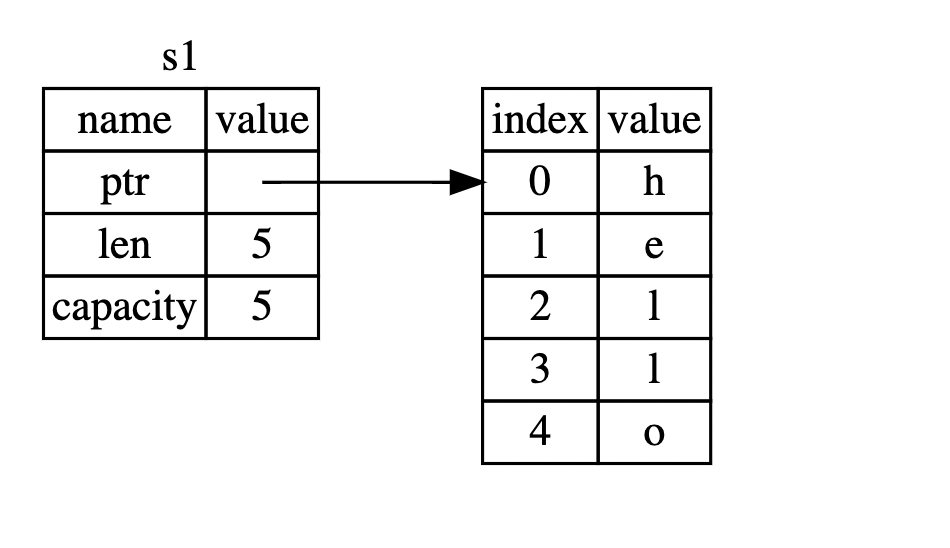

# Undertanding Ownership

## What is Ownership?

- Ownership is a set of rules that govern how a Rust program manages memory. All programs have to manage the way they use a computer’s memory while running. Some languages have garbage collection that regularly looks for no-longer-used memory as the program runs; in other languages, the programmer must explicitly allocate and free the memory.
- Whereas Rust uses a third approach: memory is managed through a system of ownership with a set of rules that the compiler checks. If any of the rules are violated, the program won’t compile. None of the features of ownership will slow down your program while it’s running.

### Ownership Rules

1. Each value in Rust has an <i>owner</i>.
2. There can only be one owner at a time.
3. When the owner goes out of scope, the value will be dropped.

### Variable Scope

A scope is the range within a program for which an item is valid. For example:<br>

```Rust
let s = "hello";
```

The variable `s` here refers to a string literal, where the value of the string is hardcoded into the text of our program. The variable is valid from the point at which it’s declared until the end of the current scope. <br>

```Rust
    {                      // s is not valid here, it’s not yet declared
        let s = "hello";   // s is valid from this point forward

        // do stuff with s
    }                      // this scope is now over, and s is no longer valid

```

To conclude we can summarise this as following:<br>

- When `s` comes into scope, it is valid.
- It remains valid until it goes out of scope.

### Memory And Allocation

In languages with a garbage collector (GC), the GC keeps track of and cleans up memory that isn’t being used anymore, and we don’t need to think about it. In most languages without a GC, it’s our responsibility to identify when memory is no longer being used and to call code to explicitly free it, just as we did to request it. Doing this correctly has historically been a difficult programming problem. If we forget, we’ll waste memory. If we do it too early, we’ll have an invalid variable. If we do it twice, that’s a bug too. We need to pair exactly one allocate with exactly one free.<br>
But Rust takes a different path: the memory is automatically returned once the variable that owns it goes out of scope.<br>

```Rust
    {
        let s = String::from("hello"); // s is valid from this point forward

        // do stuff with s
    }                                  // this scope is now over, and s is no
                                       // longer valid
```

When a variable goes out of scope, Rust calls a special function for us. This function is called `drop`, and it’s where the author of `String` can put the code to return the memory. Rust calls `drop` automatically at the closing curly bracket. This pattern of deallocating resources at the end of an item’s lifetime is similar to C++'s Resource Acquisition Is Initialization (RAII).

### Variables and Data Interacting with Move

Multiple variables can interact with the same data in different ways in Rust

```Rust
    let x = 5;
    let y = x;
```

Here we “bind the value 5 to `x`; then make a copy of the value in `x` and bind it to `y`.” We now have two variables, x and y, and both equal `5`. The x and y are having a value 5 which is now pushed onto the stack.<br>

Now looking at the `String` version:

```Rust
    let s1 = String::from("hello");
    let s2 = s1;

```

One can assume that the way it works would be the same: that is, the second line would make a copy of the value in `s1` and bind it to `s2`.<br>

##### BUT WE ARE WRONG!!!

A `String` is made up of three parts, shown on the left: a pointer to the memory that holds the contents of the string, a length, and a capacity. This group of data is stored on the stack. On the right is the memory on the heap that holds the contents.<br>



The length is how much memory, in bytes, the contents of the String are currently using. The capacity is the total amount of memory, in bytes, that the String has received from the allocator. For now we can ignore the capacity.<br>
When we assign s1 to s2, the String data is copied, meaning we copy the pointer, the length, and the capacity that are on the stack. We do not copy the data on the heap that the pointer refers to. In other words, the data representation in memory looks like following:


The representation does not look like figure below, which is what memory would look like if Rust instead copied the heap data as well. If Rust did this, the operation s2 = s1 could be very expensive in terms of runtime performance if the data on the heap were large.<br>

